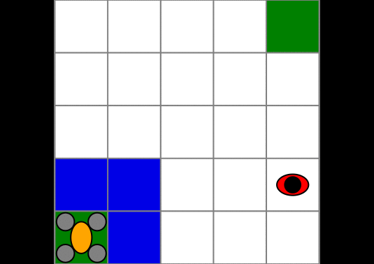

# DroneSurveillance.jl

[](https://github.com/JuliaPOMDP/DroneSurveillance.jl/actions)
[](https://codecov.io/gh/juliapomdp/DroneSurveillance.jl)


Implementation of a drone surveillance problem<sup>1</sup> with the [POMDPs.jl](https://github.com/JuliaPOMDP/POMDPs.jl).

<sup>1</sup> M. Svoreňová, M. Chmelík, K. Leahy, H. F. Eniser, K. Chatterjee, I. Černá, C. Belta, "
Temporal logic motion planning using POMDPs with parity objectives: case study paper", *International Conference on Hybrid Systems: Computation and Control (HSCC)*, 2015.



## Installation

```julia
using Pkg
Pkg.add(PackageSpec(url="https://github.com/JuliaPOMDP/DroneSurveillance.jl"))
```


## Example

```julia
using DroneSurveillance
using POMDPs

# import a solver from POMDPs.jl e.g. SARSOP
using SARSOP

# for visualization
using POMDPGifs
import Cairo

pomdp = DroneSurveillancePOMDP() # initialize the problem 

solver = SARSOPSolver(precision=1e-3) # configure the solver

policy = solve(solver, pomdp) # solve the problem

makegif(pomdp, policy, filename="out.gif")
```


## Problem Description

A drone must survey two region (in green) while avoiding to fly over a ground agent. The drone has a limited field of view. 

- **States**: position of the drone and the agent in the grid world
  
- **Actions**: Moving up, down, left, right, or hovering over the current cell.
  
- **Transition model**: The drone moves deterministically to the desired cell depending on the action chosen. The agent follows a random policy, it can stay in the same cell or move to a neighboring cell with equal probability. In addition the agent cannot enter the area to survey.
  
- **Observation model**: if the agent is in the field of view of the drone, the drone observes the position of the agent within its field of view with probability 1, otherwise it does not observe the agent (value `OUT`).
  
- **Initial state**: the drone starts in the bottom left corner, the agent is initialized outside the field of view of the drone.
  
- **Reward model**: a naive reward model is implemented, the drone receives +1 for reaching the second area to survey, and -1 if it flies over the ground agent.


### `DroneSurveillancePOMDP` Parameters

- constructor: `DroneSurveillancePOMDP(kwargs...)`
- keyword arguments:
  - `size::Tuple{Int64, Int64} = (5,5)` size of the grid world
  - `region_A::DSPos = [1, 1]` first region to survey, initial state of the quad
  - `region_B::DSPos = [size[1], size[2]]` second region to survey
  - `fov::Tuple{Int64, Int64} = (3, 3)` size of the field of view of the drone
  - `agent_policy::Symbol = :random` policy of the other agent, only random is implemented
  - `terminal_state::DSState = DSState([-1, -1], [-1, -1])` a sentinel state to encode terminal states
  - `discount_factor::Float64 = 0.95` the discount factor

### Internal types:

- `DSPos` represents a position in the grid as a static array of 2 integers
- `DSState` represents the state of the environment, the field `quad` represents the position of the drone and the file `agent` the position of the ground agent
  